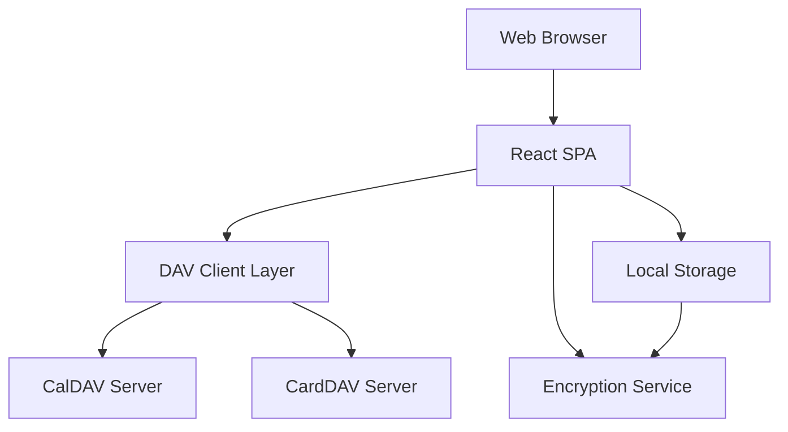

# Design Document

## Overview

The CalDAV/CardDAV web client is a single-page application (SPA) built with modern web technologies that communicates directly with CalDAV and CardDAV servers. The application operates entirely in the browser without requiring a backend server, using browser local storage for credential management and data caching. Initially designed to work with Baikal servers, the architecture is componentized to support multiple DAV server providers including Radicale and others in the future.

## Architecture

### High-Level Architecture



### Technology Stack

- **Frontend Framework**: React with TypeScript for type safety and component-based architecture
- **HTTP Client**: Axios for DAV protocol communication with request/response interceptors
- **Data Parsing**: 
  - ICAL.js for iCalendar (.ics) parsing and generation
  - vCard parsing library for contact data
- **Encryption**: Web Crypto API for credential encryption in local storage
- **UI Components**: Material-UI or similar component library for consistent interface
- **State Management**: React Context API with useReducer for application state

### Provider Architecture

The application uses a provider pattern to support different DAV server implementations:

- **Baikal Provider**: Primary implementation targeting Baikal/Sabre servers
- **Provider Registry**: Extensible system for adding new server providers
- **Auto-Detection**: Capability to detect server type and select appropriate provider
- **Provider-Specific Customizations**: Handle server-specific URL patterns, authentication methods, and protocol variations

## Components and Interfaces

### Core Components

#### 1. Authentication Manager
```typescript
interface AuthConfig {
  caldavUrl: string;
  carddavUrl: string;
  username: string;
  password: string;
}

interface AuthManager {
  authenticate(config: AuthConfig): Promise<boolean>;
  getStoredCredentials(): AuthConfig | null;
  clearCredentials(): void;
}
```

#### 2. DAV Client Service (Provider Abstraction)
```typescript
interface DAVProvider {
  name: string;
  detectServer(baseUrl: string): Promise<boolean>;
  getCalendarDiscoveryPath(): string;
  getAddressBookDiscoveryPath(): string;
  customizeRequest?(request: DAVRequest): DAVRequest;
}

interface DAVClient {
  setProvider(provider: DAVProvider): void;
  discoverCalendars(): Promise<Calendar[]>;
  discoverAddressBooks(): Promise<AddressBook[]>;
  getEvents(calendar: Calendar, dateRange: DateRange): Promise<CalendarEvent[]>;
  getContacts(addressBook: AddressBook): Promise<Contact[]>;
  createEvent(calendar: Calendar, event: CalendarEvent): Promise<void>;
  updateEvent(calendar: Calendar, event: CalendarEvent): Promise<void>;
  createContact(addressBook: AddressBook, contact: Contact): Promise<void>;
  updateContact(addressBook: AddressBook, contact: Contact): Promise<void>;
}

// Initial provider implementations
interface BaikalProvider extends DAVProvider {
  name: 'baikal';
}

interface RadicaleProvider extends DAVProvider {
  name: 'radicale';
}
```

#### 3. Data Models
```typescript
interface CalendarEvent {
  uid: string;
  summary: string;
  description?: string;
  dtstart: Date;
  dtend: Date;
  location?: string;
  etag?: string;
}

interface Contact {
  uid: string;
  fn: string; // Full name
  email?: string[];
  tel?: string[];
  org?: string;
  etag?: string;
}

interface Calendar {
  url: string;
  displayName: string;
  color?: string;
}

interface AddressBook {
  url: string;
  displayName: string;
}
```

### UI Components

#### 1. Setup/Configuration Component
- Server URL input fields
- Credential input with secure handling
- Connection testing functionality
- Settings persistence

#### 2. Calendar Components
- Calendar grid view (month/week/day)
- Event list view
- Event creation/editing modal
- Date navigation controls

#### 3. Contact Components
- Contact list with search/filter
- Contact detail view
- Contact creation/editing form
- Contact import/export functionality

#### 4. Common Components
- Loading indicators
- Error message displays
- Confirmation dialogs
- Navigation menu

## Data Models

### Local Storage Schema

```typescript
interface StoredData {
  credentials: EncryptedCredentials;
  calendars: Calendar[];
  addressBooks: AddressBook[];
  cachedEvents: { [calendarUrl: string]: CalendarEvent[] };
  cachedContacts: { [addressBookUrl: string]: Contact[] };
  lastSync: { [resourceUrl: string]: Date };
}

interface EncryptedCredentials {
  data: string; // Encrypted JSON of AuthConfig
  iv: string;   // Initialization vector
}
```

### DAV Protocol Handling

#### CalDAV Operations
- **Discovery**: PROPFIND requests to discover calendar collections
- **Event Retrieval**: REPORT requests with VEVENT filters
- **Event Creation**: PUT requests with iCalendar data
- **Event Updates**: PUT requests with If-Match headers using ETags

#### CardDAV Operations
- **Discovery**: PROPFIND requests to discover address book collections
- **Contact Retrieval**: REPORT requests with VCARD filters
- **Contact Creation**: PUT requests with vCard data
- **Contact Updates**: PUT requests with If-Match headers using ETags

## Error Handling

### Network Error Handling
- Retry logic with exponential backoff for transient failures
- Offline mode detection and graceful degradation
- User-friendly error messages for different failure scenarios
- Automatic reconnection attempts when network is restored

### Authentication Error Handling
- Clear indication of authentication failures
- Secure credential re-entry without exposing stored data
- Session timeout handling
- Invalid server URL detection and guidance

### Data Conflict Resolution
- ETag-based conflict detection
- User-prompted conflict resolution for simultaneous edits
- Local change preservation during network failures
- Sync status indicators for pending operations

### CORS Handling
- Clear documentation for users about CORS requirements
- Helpful error messages when CORS blocks requests
- Guidance for server configuration or proxy setup

## Testing Strategy

### Unit Testing
- DAV client service methods with mocked HTTP responses
- Data parsing and serialization functions
- Encryption/decryption utilities
- Component rendering and user interactions

### Integration Testing
- End-to-end DAV protocol communication
- Local storage persistence and retrieval
- Error handling scenarios
- Cross-browser compatibility testing

### Manual Testing
- Real CalDAV/CardDAV server integration with Baikal (primary target)
- Provider extensibility testing with Radicale and other implementations
- Network failure simulation
- Browser storage limitation testing
- Provider auto-detection and fallback mechanisms

### Security Testing
- Credential encryption verification
- Local storage data inspection
- Network request monitoring for credential leakage
- XSS and injection vulnerability assessment